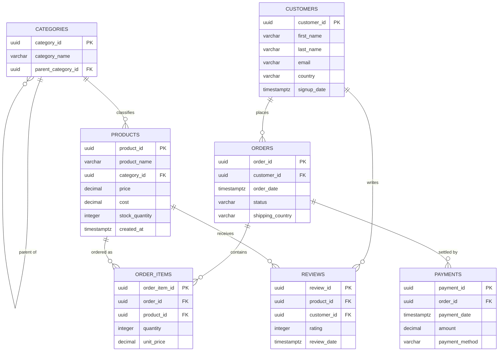

# 🛒 NorthStar e-Commerce — Database Schema Documentation

> **NorthStar Commerce** is a mid-sized online retailer selling electronics, home goods, and apparel. This document describes the PostgreSQL database schema that powers its catalog, customer, order, payment, and review data.

---

## 📐 Entity-Relationship Diagram



---

## 📊 Schema Overview

| # | Table | Purpose | Row Type |
|---|-------|---------|----------|
| 1 | [`categories`](#1--categories) | Hierarchical product classification | Reference |
| 2 | [`products`](#2--products) | Catalog of sellable items | Reference |
| 3 | [`customers`](#3--customers) | Registered shoppers | Master data |
| 4 | [`orders`](#4--orders) | Purchase transactions | Transactional |
| 5 | [`order_items`](#5--order_items) | Line items within an order | Transactional |
| 6 | [`payments`](#6--payments) | Payments applied to orders | Transactional |
| 7 | [`reviews`](#7--reviews) | Customer product ratings | Transactional |

---

## 🗂️ Table Definitions

### 1. `categories`
*Stores product categories and their hierarchy (self-referencing tree).*

| Column | Type | Constraints | Description |
|---|---|---|---|
| `category_id` | `UUID` | 🔑 Primary Key, default `uuid_generate_v4()` | Unique category identifier |
| `category_name` | `VARCHAR(100)` | `NOT NULL` | Display name, e.g. *"Smartphones"* |
| `parent_category_id` | `UUID` | 🔗 FK → `categories.category_id` | Parent category (`NULL` for top-level) |

**Seeded top-level structure:**

```
Electronics
├── Smartphones
├── Laptops
└── Accessories

Home Goods
├── Furniture
├── Kitchenware
└── Decor

Apparel
├── Men's Clothing
├── Women's Clothing
└── Footwear
```

---

### 2. `products`
*Catalog of items available for sale.*

| Column | Type | Constraints | Description |
|---|---|---|---|
| `product_id` | `UUID` | 🔑 Primary Key, default `uuid_generate_v4()` | Unique product identifier |
| `product_name` | `VARCHAR(255)` | `NOT NULL` | Product title, e.g. *"iPhone 15 Pro"* |
| `category_id` | `UUID` | `NOT NULL`, 🔗 FK → `categories.category_id` | Owning category |
| `price` | `DECIMAL(10,2)` | `NOT NULL` | Retail sale price |
| `cost` | `DECIMAL(10,2)` | `NOT NULL` | Wholesale/unit cost |
| `stock_quantity` | `INTEGER` | `NOT NULL`, default `0` | Units currently in stock |
| `created_at` | `TIMESTAMPTZ` | default `CURRENT_TIMESTAMP` | When the product was added |

---

### 3. `customers`
*Registered shoppers.*

| Column | Type | Constraints | Description |
|---|---|---|---|
| `customer_id` | `UUID` | 🔑 Primary Key, default `uuid_generate_v4()` | Unique customer identifier |
| `first_name` | `VARCHAR(100)` | `NOT NULL` | Given name |
| `last_name` | `VARCHAR(100)` | `NOT NULL` | Family name |
| `email` | `VARCHAR(255)` | `UNIQUE`, `NOT NULL` | Login / contact email |
| `country` | `VARCHAR(100)` | `NOT NULL` | Customer's home country |
| `signup_date` | `TIMESTAMPTZ` | default `CURRENT_TIMESTAMP` | Account creation date |

---

### 4. `orders`
*A single purchase transaction placed by a customer.*

| Column | Type | Constraints | Description |
|---|---|---|---|
| `order_id` | `UUID` | 🔑 Primary Key, default `uuid_generate_v4()` | Unique order identifier |
| `customer_id` | `UUID` | `NOT NULL`, 🔗 FK → `customers.customer_id` | Customer who placed the order |
| `order_date` | `TIMESTAMPTZ` | default `CURRENT_TIMESTAMP` | When the order was placed |
| `status` | `VARCHAR(50)` | `NOT NULL` | e.g. *pending, shipped, delivered, cancelled* |
| `shipping_country` | `VARCHAR(100)` | `NOT NULL` | Destination country |

---

### 5. `order_items`
*Individual line items within an order (many-to-many bridge between orders and products).*

| Column | Type | Constraints | Description |
|---|---|---|---|
| `order_item_id` | `UUID` | 🔑 Primary Key, default `uuid_generate_v4()` | Unique line-item identifier |
| `order_id` | `UUID` | `NOT NULL`, 🔗 FK → `orders.order_id` | Parent order |
| `product_id` | `UUID` | `NOT NULL`, 🔗 FK → `products.product_id` | Product purchased |
| `quantity` | `INTEGER` | `NOT NULL`, default `1` | Units of this product |
| `unit_price` | `DECIMAL(10,2)` | `NOT NULL` | Price per unit at time of purchase |

---

### 6. `payments`
*Payments applied against an order.*

| Column | Type | Constraints | Description |
|---|---|---|---|
| `payment_id` | `UUID` | 🔑 Primary Key, default `uuid_generate_v4()` | Unique payment identifier |
| `order_id` | `UUID` | `NOT NULL`, 🔗 FK → `orders.order_id` | Order being paid for |
| `payment_date` | `TIMESTAMPTZ` | default `CURRENT_TIMESTAMP` | Date payment was processed |
| `amount` | `DECIMAL(10,2)` | `NOT NULL` | Payment amount |
| `payment_method` | `VARCHAR(50)` | `NOT NULL` | e.g. *credit_card, paypal, bank_transfer* |

---

### 7. `reviews`
*Customer ratings and feedback on products.*

| Column | Type | Constraints | Description |
|---|---|---|---|
| `review_id` | `UUID` | 🔑 Primary Key, default `uuid_generate_v4()` | Unique review identifier |
| `product_id` | `UUID` | `NOT NULL`, 🔗 FK → `products.product_id` | Product being reviewed |
| `customer_id` | `UUID` | `NOT NULL`, 🔗 FK → `customers.customer_id` | Reviewing customer |
| `rating` | `INTEGER` | `NOT NULL`, `CHECK (rating BETWEEN 1 AND 5)` | Star rating, 1–5 |
| `review_date` | `TIMESTAMPTZ` | default `CURRENT_TIMESTAMP` | When the review was submitted |

---

## 🔗 Relationship Summary

| Relationship | Cardinality | Notes |
|---|---|---|
| `categories` → `categories` | 1-to-many | Self-referencing parent/child hierarchy |
| `categories` → `products` | 1-to-many | Every product belongs to exactly one category |
| `customers` → `orders` | 1-to-many | A customer can place many orders |
| `customers` → `reviews` | 1-to-many | A customer can write many reviews |
| `orders` → `order_items` | 1-to-many | An order contains one or more line items |
| `orders` → `payments` | 1-to-many | An order can have one or more payments |
| `products` → `order_items` | 1-to-many | A product can appear in many order items |
| `products` → `reviews` | 1-to-many | A product can receive many reviews |

---

## ⚡ Indexes

Applied to speed up common joins and lookups:

```sql
CREATE INDEX idx_products_category    ON products(category_id);
CREATE INDEX idx_orders_customer      ON orders(customer_id);
CREATE INDEX idx_order_items_order    ON order_items(order_id);
CREATE INDEX idx_order_items_product  ON order_items(product_id);
CREATE INDEX idx_payments_order       ON payments(order_id);
CREATE INDEX idx_reviews_product      ON reviews(product_id);
CREATE INDEX idx_reviews_customer     ON reviews(customer_id);
```

---

## 🏗️ Full DDL Script

```sql
-- ============================================================
-- NorthStar e-Commerce Database Schema
-- ============================================================

-- Step 1: Create the database
CREATE DATABASE northstar_ecommerce;
\c northstar_ecommerce

-- Step 2: Create the schema
CREATE SCHEMA IF NOT EXISTS northstar_ecommerce;
SET search_path TO northstar_ecommerce;

-- Step 3: Enable UUID extension for realistic IDs
CREATE EXTENSION IF NOT EXISTS "uuid-ossp";

-- Step 4: Drop tables if they already exist (for repeatable setup)
DROP TABLE IF EXISTS reviews;
DROP TABLE IF EXISTS payments;
DROP TABLE IF EXISTS order_items;
DROP TABLE IF EXISTS orders;
DROP TABLE IF EXISTS products;
DROP TABLE IF EXISTS customers;
DROP TABLE IF EXISTS categories;

-- Step 5: Create tables -----------------------------------------

CREATE TABLE categories (
    category_id         UUID PRIMARY KEY DEFAULT uuid_generate_v4(),
    category_name       VARCHAR(100) NOT NULL,
    parent_category_id  UUID REFERENCES categories(category_id)
);

CREATE TABLE products (
    product_id      UUID PRIMARY KEY DEFAULT uuid_generate_v4(),
    product_name    VARCHAR(255) NOT NULL,
    category_id     UUID NOT NULL REFERENCES categories(category_id),
    price           DECIMAL(10, 2) NOT NULL,
    cost            DECIMAL(10, 2) NOT NULL,
    stock_quantity  INTEGER NOT NULL DEFAULT 0,
    created_at      TIMESTAMP WITH TIME ZONE DEFAULT CURRENT_TIMESTAMP
);

CREATE TABLE customers (
    customer_id   UUID PRIMARY KEY DEFAULT uuid_generate_v4(),
    first_name    VARCHAR(100) NOT NULL,
    last_name     VARCHAR(100) NOT NULL,
    email         VARCHAR(255) UNIQUE NOT NULL,
    country       VARCHAR(100) NOT NULL,
    signup_date   TIMESTAMP WITH TIME ZONE DEFAULT CURRENT_TIMESTAMP
);

CREATE TABLE orders (
    order_id           UUID PRIMARY KEY DEFAULT uuid_generate_v4(),
    customer_id        UUID NOT NULL REFERENCES customers(customer_id),
    order_date         TIMESTAMP WITH TIME ZONE DEFAULT CURRENT_TIMESTAMP,
    status             VARCHAR(50) NOT NULL,
    shipping_country   VARCHAR(100) NOT NULL
);

CREATE TABLE order_items (
    order_item_id  UUID PRIMARY KEY DEFAULT uuid_generate_v4(),
    order_id       UUID NOT NULL REFERENCES orders(order_id),
    product_id     UUID NOT NULL REFERENCES products(product_id),
    quantity       INTEGER NOT NULL DEFAULT 1,
    unit_price     DECIMAL(10, 2) NOT NULL
);

CREATE TABLE payments (
    payment_id      UUID PRIMARY KEY DEFAULT uuid_generate_v4(),
    order_id        UUID NOT NULL REFERENCES orders(order_id),
    payment_date    TIMESTAMP WITH TIME ZONE DEFAULT CURRENT_TIMESTAMP,
    amount          DECIMAL(10, 2) NOT NULL,
    payment_method  VARCHAR(50) NOT NULL
);

CREATE TABLE reviews (
    review_id     UUID PRIMARY KEY DEFAULT uuid_generate_v4(),
    product_id    UUID NOT NULL REFERENCES products(product_id),
    customer_id   UUID NOT NULL REFERENCES customers(customer_id),
    rating        INTEGER NOT NULL CHECK (rating BETWEEN 1 AND 5),
    review_date   TIMESTAMP WITH TIME ZONE DEFAULT CURRENT_TIMESTAMP
);

-- Step 6: Indexes -------------------------------------------------

CREATE INDEX idx_products_category    ON products(category_id);
CREATE INDEX idx_orders_customer      ON orders(customer_id);
CREATE INDEX idx_order_items_order    ON order_items(order_id);
CREATE INDEX idx_order_items_product  ON order_items(product_id);
CREATE INDEX idx_payments_order       ON payments(order_id);
CREATE INDEX idx_reviews_product      ON reviews(product_id);
CREATE INDEX idx_reviews_customer     ON reviews(customer_id);

-- Step 7: Documentation comments -----------------------------------

COMMENT ON TABLE categories   IS 'Table for storing product categories and their hierarchy.';
COMMENT ON TABLE products     IS 'Table for storing product information.';
COMMENT ON TABLE customers    IS 'Table for storing customer information.';
COMMENT ON TABLE orders       IS 'Table for storing order information.';
COMMENT ON TABLE order_items  IS 'Table for storing individual items in orders.';
COMMENT ON TABLE payments     IS 'Table for storing payment information.';
COMMENT ON TABLE reviews      IS 'Table for storing product reviews.';
```

> 💡 **Note on seed data:** The original source file also includes several thousand lines of `INSERT` statements that populate these tables with realistic sample data — 3 top-level categories (Electronics, Home Goods, Apparel) with sub-categories, dozens of products, hundreds of customers, and thousands of orders, order items, payments, and reviews spanning 2024. That bulk seed data has been omitted here to keep this reference document readable; the full script (DDL + seed data) is available in the original uploaded file if you need to re-run it.

---

## 📁 Quick Reference: Primary & Foreign Keys

| Table | Primary Key | Foreign Keys |
|---|---|---|
| `categories` | `category_id` | `parent_category_id` → `categories.category_id` |
| `products` | `product_id` | `category_id` → `categories.category_id` |
| `customers` | `customer_id` | — |
| `orders` | `order_id` | `customer_id` → `customers.customer_id` |
| `order_items` | `order_item_id` | `order_id` → `orders.order_id`, `product_id` → `products.product_id` |
| `payments` | `payment_id` | `order_id` → `orders.order_id` |
| `reviews` | `review_id` | `product_id` → `products.product_id`, `customer_id` → `customers.customer_id` |

---

*Document generated from `NorthStar_e-Commerce_Database_Schema.md`.*
